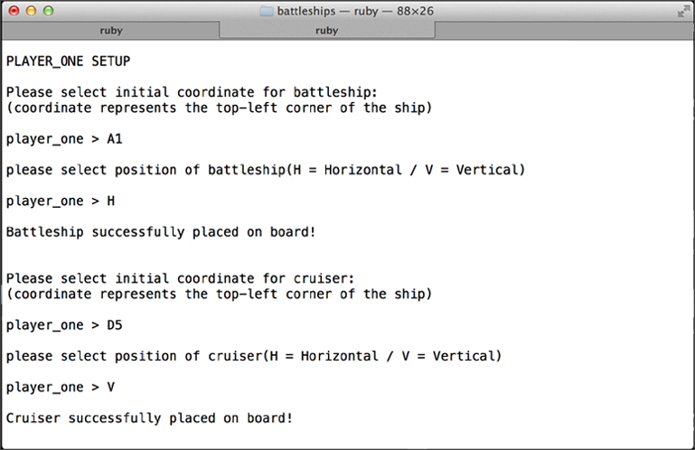
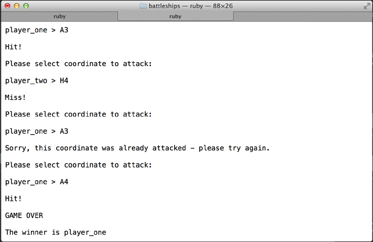
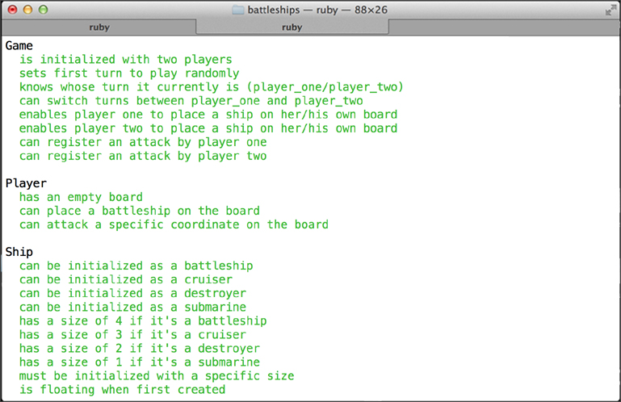

#Battleships

## Table of Contents

* [Screenshots](#screenshots)
* [General Description](#general-description)
* [Running the Game in Terminal](#running-the-game-in-terminal)
* [Rules of the Game](#rules-of-the-game)
* [Testing](#testing)
* [License](#license)


##Screenshots

<table>
	<tr>
		<td align="center" width="200px">
			<a href="https://raw.githubusercontent.com/nadavmatalon/battleships/master/images/battleships_1.jpg">
				
				 Setup
			</a>
		</td>
		<td align="center" width="200px">
			<a href="https://raw.githubusercontent.com/nadavmatalon/battleships/master/images/battleships_2.jpg">
				
				 Play
			</a>
		</td>
		<td align="center" width="200px">
			<a href="https://raw.githubusercontent.com/nadavmatalon/battleships/master/images/battleships_3.jpg">
				
				 Testing
			</a>
		</td>
	</tr>
</table>


##General Description

This terminal-based version of the game of __Battleships__ was pair-programmed in 
[Ruby](https://www.ruby-lang.org/en/) (2.1.1) according to 
[TDD](http://en.wikipedia.org/wiki/Test-driven_development) 
(testing done with [Rspec](http://rspec.info/)) during week 4 of the course at 
[Makers Academy](http://www.makersacademy.com/).

For more information about the game see: [Wikipedia on Battleships](http://en.wikipedia.org/wiki/Battleship_(game))


##Running the Game

To run the game in terminal, clone the repo to a local folder, 
then run the following commands and follow the on-screen instructions:

```bash
$> cd battleships
$> ruby ./lib/run_battleships.rb
```


##Rules of the Game

The goal of Battleships is to sink all of the other player's ships before
they manage to sink your own ships. 

The game begins with each player setting up their own board with a set of 10 ships of
different kinds (and without letting the other player peak!)

Each player set of ships consists of:

* 1 x __Battleship__           (covers 4 squares)
* 2 x __Cruisers__             (each covering 3 squares)
* 3 x __Destroyers__           (each covering 2 squares)
* 4 x __Submarines__           (each covering 1 square)

Ships must be placed either in a vetical or horizontal position.

To place a ship, the player need to select an initial coordinate on the grid 
(ranging between A-J and 1-10), for example: A1. 

This coordinate represents the top-left corner of the ship's position.

Then the player needs to select whether to place it horizontally or vertically.

Also note that a ship can't be placed on top of another ship.

If the coordinates are legitimate (within the board) the ship is placed and 
the player can place the next ship in line.

(on-screen feedback is given if the placement was successful or not)

Once the two boards are set, the players take turns attacking a single 
coordinate (eg A1) on the other player's board in each turn, so as
to try and hit the other player's ships. 

If the attack is successful the game issues a 'ship hit' message.

When all the coordinates of a given ship are hit, it sinks and the game issues a 
'ship sunk' message.

The player who manages to sink all of the other player's ships is the winner.


##Testing

Tests were written with [Rspec](http://rspec.info/) (3.1.7).

To run the testing suite in terminal: 

```bash
$> cd battleships
$> rspec
```

##License

<p>Released under the <a href="http://www.opensource.org/licenses/MIT">MIT license</a>.</p>

